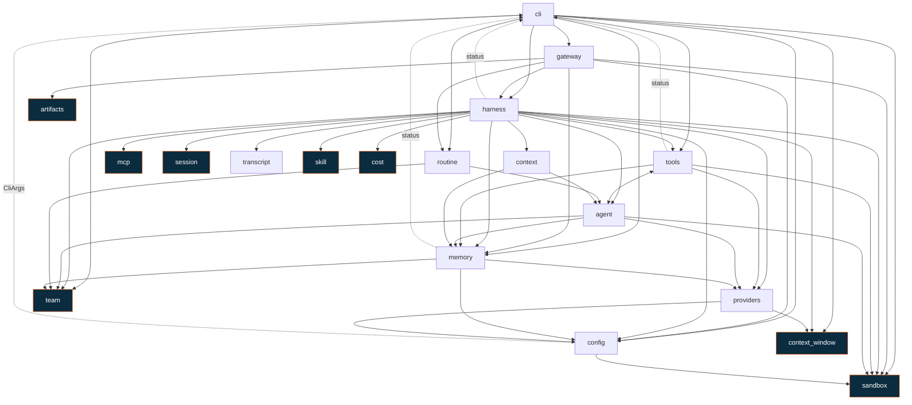

# Project Landscape

What is in this repository, how the pieces depend on each other, and the places
where that dependency graph will bite you.

> Generated by reading the source, not from memory. The dependency edges below
> come from every `crate::<module>` reference in `src/`, so they include
> fully-qualified uses that a `use` statement alone would miss.
>
> **Last verified:** 2026-08-19 · `dev` · rust 25,429 lines · web 6,017 · desktop 1,660

---

## 1. The four parts

```
                     ┌───────────────────────────────────┐
                     │  desktop/   Tauri shell           │
                     │  Rust · 1.7k lines · 7 files      │
                     │  keychain · menus · supervision   │
                     └───────┬───────────────────┬───────┘
                    spawns   │                   │  embeds the build
                             ▼                   ▼
      ┌──────────────────────────────┐   ┌──────────────────────────┐
      │  src/    momo-fetch          │   │  web/   Next.js          │
      │  Rust · 25k lines · 18 mods  │   │  TS · 6.0k · 50 files    │
      │                              │   │  static export           │
      │  REPL · -p oneshot           │   │  no JS server anywhere   │
      │  --gateway  (v1 + v2 HTTP)   │   └──────────────────────────┘
      └──────────────────────────────┘              │
                     ▲    │                         │
                     │    └── serves the build at /ui
                     └───────── HTTP + SSE ─────────┘

   brand/     artwork generator (python, run by hand)
   scripts/   operator scripts
   docs/      spec + guides
   patches/   vendored rmcp — the build depends on it
   memory-vault/, ralph/, target/   not build inputs
```

**One binary, three entry modes.** `--gateway` is not a separate service; it is
`momo-fetch` with an HTTP surface bolted on, running the same `Harness` as the
REPL. That is why a single bug reaches all three modes — see [§6](#6-before-you-change-things).

**Nothing in `src/` knows `web/` or `desktop/` exists**, except that the gateway
serves whatever static directory `ui_dir` points at. The arrows only run one way.

---

## 2. `src/` — the harness

19 modules. Four of them are 80% of the code.

### The big four

| Module | Lines | Files | What lives there |
|---|---:|---:|---|
| **`memory/`** | 4,618 | 7 | `vault.rs` (the largest file in the repo), `sidecar.rs`, `retrieval.rs`, `parser.rs`, `lifecycle.rs`, `types.rs` |
| **`tools/`** | 4,489 | 8 | `file` · `shell` · `search` · `web` · `kms` · `memory` · `task` (sub-agent spawn) |
| **`gateway/`** | 4,621 | 11 | `mod` (router + the routine tick loop) · `v2_handlers` · `handlers` (v1) · `files` (sandboxed reads) · `models` (provider catalogue) · `routines` (`/v2/routines`) · `activity` (`/v2/activity`) · `turn` (one-turn-at-a-time guard) · `auth` · `types`/`v2_types` |
| **`cli/`** | 5,814 | 9 | `repl` · `commands` (slash commands, incl. `/routine`) · `oneshot` · `team_cmd` (headless `momo-fetch team …`) · `routine_cmd` (headless `momo-fetch routine …`) · `team_worker` (standby worker loop) · `status` · `banner` · `mod` (arg parsing) |

### The core

| Module | Lines | Role |
|---|---:|---|
| **`harness.rs`** | 836 | **Assembles everything.** Runner, tool registry, session, `approved_tools`, `rebuild_runner()`. Every mode goes through it |
| `cost.rs` | 955 | Token accounting and pricing. `:free` models short-circuit to zero |
| `providers.rs` | 544 | Provider registry, availability, liveness probe |
| `context_window.rs` | 492 | Model context sizes |
| `session.rs` | 656 | SQLite session store. Owns the pool (WAL + busy timeout) and retries the writes SQLite refuses under concurrency |
| `artifacts.rs` | 323 | Stamps the sandbox tree before/after a turn; the `artifacts` event is the difference |
| `transcript.rs` | 335 | Reassembles a streamed reply into one stored event — adk persists none of it |
| `main.rs` | 39 | Declares the modules and calls `cli` |

### Supporting

| Module | Lines | Role |
|---|---:|---|
| `team/` | 2,404 | Multi-agent teams: mailbox, tmux panes, worktrees, worker liveness |
| `routine/` | 2,446 | Scheduled work: `cron` (five-field parser) · `exec` (detached run + exit file) · `view` (JSON shapes) · `mod` (store + the pure `decide`) |
| `agent/` | 844 | Agent personalities + `orchestrator` (sub-agent spawn/message) |
| `mcp/` | 777 | MCP servers, stdio + HTTP, merged into one toolset |
| `sandbox/` | 672 | Path resolution and destructive-command detection |
| `config/` | 542 | Settings files + `secrets.rs` (OS keychain) |
| `context/` | 448 | Prompt assembly |
| `skill/` | 389 | Skill loading |

---

## 3. Dependency graph

Edges are "module A references module B", from every `crate::<module>` mention
in the source. Highlighted nodes are leaves — they reference nothing else in the
crate.



Every edge in this graph is in the source; nothing is elided for tidiness. The
dotted ones point *back up* into `cli` and are the cycles — see [§4](#4-cycles).

**Leaves** (depend on nothing in the crate): `sandbox` · `session` · `skill` ·
`cost` · `mcp` · `team` · `context_window` · `artifacts`. These are the safe
modules to change in isolation. `transcript` reaches only `session`, and only
in its tests.

**Most depended on:** `sandbox` (5) · `memory` (5) · `config` (5) ·
`team` (4) · `providers` (3).

`harness` reaches 15 of the other 18 modules. It is the assembly point, and it
is the reason nothing in this crate is really isolated from anything else.

---

## 4. Cycles

Rust allows module cycles inside a crate, so these compile. They are still worth
knowing about, because they are the edges that make "just move this file"
expensive.

| Cycle | Cause | Real? |
|---|---|---|
| `cli ↔ harness`<br>`cli ↔ memory`<br>`cli ↔ tools` | One misfiled type, counted three times. `cli::status::{StatusChannel, StatusSender}` is a progress-reporting channel, referenced by `harness.rs:30`, `memory/sidecar.rs:213` and `tools/task.rs:26`. Nothing about it is CLI-specific | ❌ accident |
| `cli ↔ config` | `config/mod.rs:9` takes `cli::CliArgs`, to layer flags over file settings | ⚠️ arguable |
| `agent ↔ tools` | Genuinely mutual composition: `tools/mod.rs:104` registers `agent::orchestrator::{SpawnAgent, SendMessage}` as tools, and `agent/orchestrator.rs:151` calls `tools::build_sub_agent_tool_registry` so the sub-agent gets its own set | ✅ inherent |

**If you want to break one, start with `status`.** Lifting it out of `cli` into
its own module removes three of the five cycles at once, and it is a mechanical
move — no logic changes, no behaviour changes.

---

## 5. `web/` and `desktop/`

### `web/src` — 57 files, 7.9k lines

Next.js **static export** (`output: 'export'`). No JavaScript server exists at
any point; the gateway serves the built files.

| Directory | Contents |
|---|---|
| `components/chat/` (6) | Chat panel, message content, tool-call cards, **approval dialog**, deep-link prompt |
| `components/layout/` (4) | `app-shell`, `header`, `sidebar`, `standing-permissions` |
| `components/settings/` (6) | `settings-dialog` + `model-panel`, `model-picker`, `api-keys-panel`, `permissions-panel`, `appearance-panel` |
| `components/detail/` (4) | `detail-panel`, `activity-section` (workers + runs in flight), `files-tab`, `memory-tab` |
| `components/routines/` (5) | `routines-dialog` (list + form + detail), `routine-form`, `routine-detail`, `routines-section` (the rail row), `form-controls` |
| `components/sidebar/` (4) | `session-list`, `agent-picker`, `team-section`, `tool-status` |
| `components/shared/` (6) | `panel-section`, `collapsible-group`, `toaster`, `wordmark`, `skeleton`, `turn-rail` |
| `lib/` | `api-client` · `sse-parser` (hand-rolled) · `desktop` · `preferences` · `recent-models` · `relative-time` · `highlight` · `sounds` · `types` |
| `stores/` | zustand: `chat-store`, `ui-store`, `toast-store` |
| `hooks/` | `use-chat-stream`, `use-gateway-resource`, `use-shortcuts`, `use-turn-cues`, `use-desktop-{boot,menu}` |

**Two builds, not interchangeable.** `npm run build` sets `basePath: '/ui'` for
the gateway; `npm run build:desktop` sets none, for Tauri at `/`. Use the wrong
one and every asset 404s.

### `desktop/src-tauri/src` — 7 files, 1.6k lines

A thin shell. It contains no agent logic at all.

| File | Role |
|---|---|
| `lib.rs` | IPC commands, startup on a background thread, shutdown on `RunEvent::Exit` |
| `gateway.rs` | Spawns and supervises `momo-fetch --gateway --gateway-port 0`, parses the listening URL from its output |
| `secrets.rs` | **The OS keychain — the only thing the shell genuinely owns.** macOS attaches an ACL per binary, so a key written here and read by the gateway would prompt the user inside a child process with no UI. The shell reads it and injects it as an env var at spawn |
| `menu.rs` | Native menu + tray, emitting one `momo:menu` event |
| `deeplink.rs` | Validates `momo://` links before the UI is allowed to act on one |
| `shell_path.rs` | Recovers the login shell's `PATH`. A Finder launch has launchd's, so the gateway could not find `npx` and every stdio MCP server failed to start |
| `main.rs` | 185 bytes |

---

## 6. Before you change things

**`harness.rs` is the bottleneck, and it is not theoretical.** Two bugs in this
repo's history came from forgetting that all three modes share it:

- The sandbox context was a `thread_local!`, set on whichever thread built the
  registry, read on whatever tokio worker later ran the tool. Every sandboxed
  tool failed intermittently — it looked like an approval bug because that path
  reshuffled the timing.
- `oneshot.rs` never called the cost lifecycle, so `momo-fetch -p` spent real
  money and recorded nothing. The spec said "REPL and gateway"; there are three
  callers.

**Three files are large enough to be contention points**, not yet broken but
worth splitting before several people work in them at once:
`memory/vault.rs` (78K) · `cli/commands.rs` (50K) · `gateway/v2_handlers.rs` (44K).

**`memory/vault.rs` holds a `std::sync::Mutex`.** Never hold it across an
`await` — spec §2.4. This is the documented lock discipline for the whole
project and the one rule most likely to produce a deadlock that tests miss.

**`patches/rmcp-1.6.0/` is a vendored crate, not a leftover.** `Cargo.toml` has
`[patch.crates-io] rmcp = { path = "patches/rmcp-1.6.0" }`. Deleting it breaks
the build.

**`memory-vault/` is runtime data the agent writes about itself.** It shows up
in `git status` constantly. It is not source.

---

## See also

- [`docs/spec/momo-worker.md`](spec/momo-worker.md) — the build plan, §0 audit, §6 UI layout, §7 endpoints
- [`docs/spec/momo-worker-scratchpad.md`](spec/momo-worker-scratchpad.md) — current status and the wave log
- **harness** — [quickstart](harness/quickstart-guide.md) · [user guide](harness/user-guide.md) · [CLI](harness/cli-guide.md) · [code guide](harness/code-guide.md)
- **desktop** — [install](desktop/momo-desktop-install.md) · [user guide](desktop/user-guide.md) · [code guide](desktop/code-guide.md) · [Tauri](desktop/tauri-guide.md)
- **web** — [quickstart](web/quickstart-guide.md) · [user guide](web/user-guide.md) · [code guide](web/code-guide.md) · [gateway API](web/gateway-api-guide.md)
- **brand** — [quickstart](brand/quickstart-guide.md) · [user guide](brand/user-guide.md) · [code guide](brand/code-guide.md) · [make-assets](brand/make-assets-guide.md)
